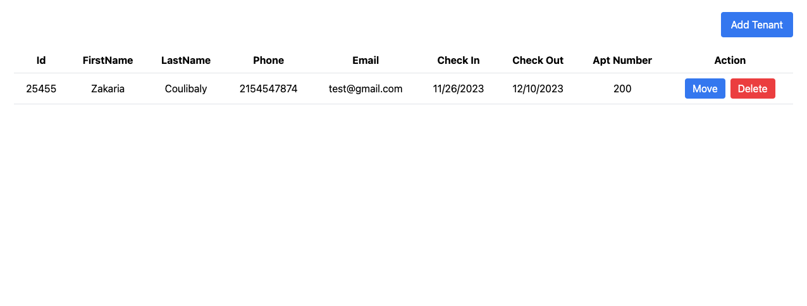
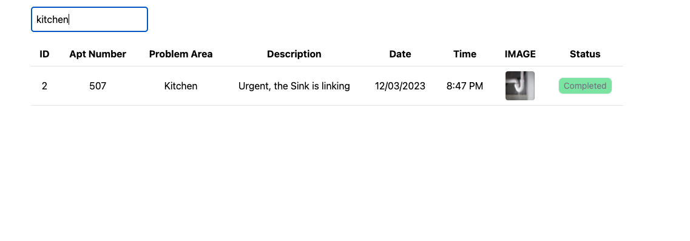

---------------- Maintenance Request Application ----------------

    - The application is a simple maintenance request application that 
       allows users to create, read, update and delete maintenance requests.
       The application is built using ReactJS in the frontend for the UI, 
       spring boot in the backend for the API and h2 database to persit all the data.
    - The all the images are stored in firebase storage and the url is stored 
        in the database.

-------------------- Functional requirement --------------------

        -----Manager:------

        -- A manager must be able to add a new tenant, move a tenant to another 
           apartment, and delete a tenant. A tenant account consists of the 
           following informa�on: tenant ID, name, phone number, email,
           date of check-in, date of check-out, and an apartment number. 

        -----Tenant:------

        -- A tenant must be able to submit a maintenance request, view the status 
           of a maintenance request. A maintenance request consists of the following
           information: request ID, tenant ID, apartment number, 
           date of request, descrip�on of the problem, and status of the request.

        ---- Maintenance Staff:----

        -- A maintenance staff must be able to view all maintenance requests, with a 
           variety of filters: by apartment number, by area (like kitchen),, and 
           view the status of a maintenance request. A staff member must be able 
           to update the status of a selected request, from ‘pending’ to ‘completed’,
           but cannot edit any other informa�on.

--------------- Functionality ------------------------

     - Since the functional requirement doesn't include the implement of the login
       and register because the manager is the only one adding the tenant, the 
       login step is not forcelly required at this stage. 

     - As stated in the functional requirement, the request id is auto generated
       but the tenant id is manually added by the manager.
     - I did my best to only focus on the functional requirement and not to add
       any extra features.

----------------- Manager ----------------------------

    The dashboard of the Manager without any tenant added:

    After clicking on the add tenant button
   
   

    After adding a tenant and clicking on submit
   

     From here, the Manager can can delete or move the tenant to another apartment.
     by changing the apartment number.

    After clicking on the move button. the information of the current tenant is loaded 
    in the dialog box and the manager can change any information he/she wants to change.
   

    Let's change the apartment number to 205 and click on submit

    The tenant is moved to apartment 205
    delete: the button delete when clicked will delete the tenant from the database.

----------------------- Tenant sending request--------------------

    Moving to the tenant dashboard
    Since the tenant is not registered yet with a login system, to make the check happen
    we want to make sure that only a tenant created by the Manager can send a request 
    and the tenant id and the apartment number have to match with the one the Manager
    created.
    
    Since the tenant did not yet submit any request, the dashboard is empty

    Let's try to send a request with a tenant id and apartment number that does not exist

    Since we don't have any tenant with the id 78888 and apartment number 8566, the request
    is not sent and the error message is displayed.

    If we remembered, the Manager had already created a tenant with the id 25455 and apartment
    number 205. That mean if we send a request with the same id and apartment number,
    the request will be sent.

    Now the request is added to the database and displayed in the dashboard with a default
    status of pending.

----------------------- Maintenance Stuff --------------------

    This is automatically sent to the Maintenance Stuff dashboard
    let's go to the maintenance staff dashboard.

    As tenant and maintenance stuff, if they don't see the image really well, they 
    hover over the image to scale it up and see it clearly.

    Every new request send to Maintenance Stuff is displayed in the dashboard with a default 
    status of pending. They have the possibility to change the status of the request from 
    pending to completed.

    Let's change the status of the request to completed that will completely
    change the background of the status from red to green and when changed, the 
    maintenance stuff will not be able to play with the status anymore which 
    will reduce the amount of API call to the backend.

    This interaction of the maintenance stuff which is changing the status 
    of the request will automatically be reflected in the tenant dashboard for 
    only the corresponding request. Let's visit the tenant dashboard and see the 
    change.

    As we can see, this is also change in the tenant dashboard and the tenant can see 
    the status of the request. The background is also changed from red to green, and 
    the status is changed from pending to completed as well.

----------------- Images ----------------------------

    For the image, we have a default image that is displayed when the tenant did
    not upload any image otherwise, it will display the image uploaded by the tenant.

-------------------- Now, let's add a bunch of tenant ----------------

------- Let's send a bunch of request by each of the tenant  ----------------

    Some with the default image and some with the image uploaded by the tenant.

    Let's go and complete some the first two as Maintenance Stuff

    Let's see the result in the tenant dashboard

---------- Maintenance staff search result -------------------------

    -- By apartment number:

    -- By Area:

    -- By Status completed:

    -- By Status Pending:

----------------- Firestore -------------------------

----------------- API Calls -------------------------

